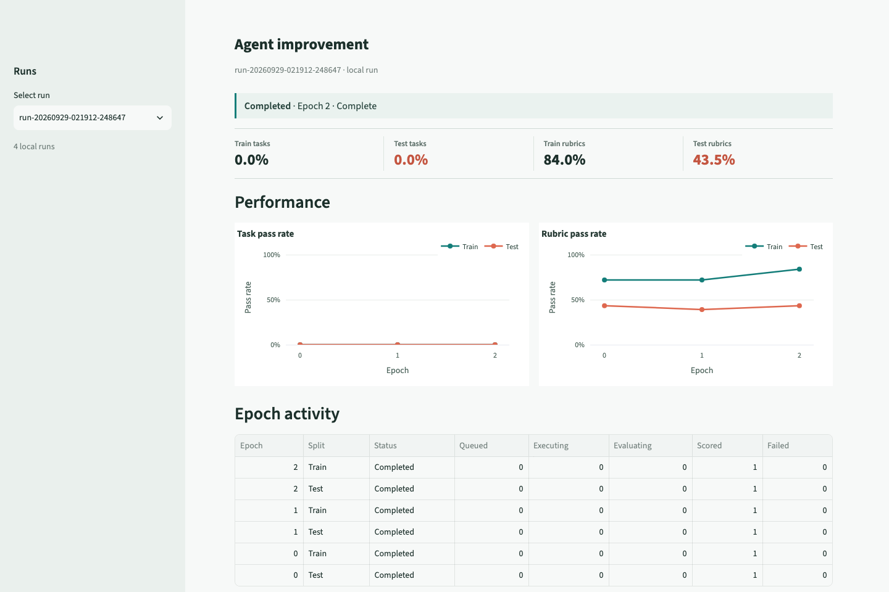
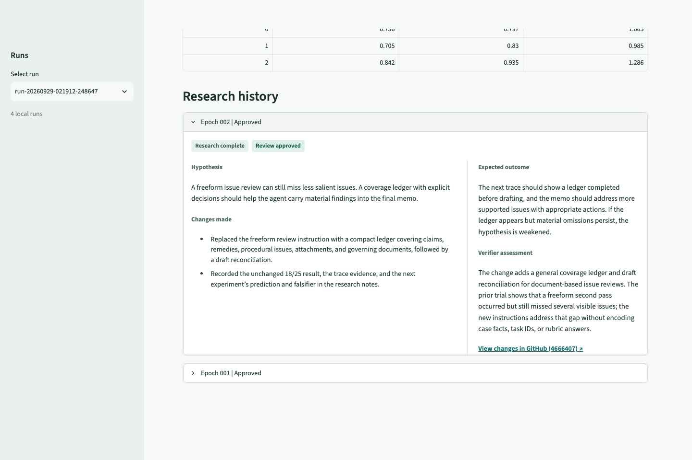

# Self-Improvement Loop

This project runs an ML-training-adjacent loop for an Introspection legal agent.
It starts from a baseline recipe, measures it on a train and held-out test split,
then repeats a bounded cycle: a Codex researcher studies training failures and
edits the recipe, a fresh Codex verifier checks that the edit is general rather
than tailored to a sample, and the runner evaluates the new recipe. Train scores
guide the researcher; test scores are visible to us for transfer monitoring but
are not supplied to the researcher.

Runs are config-driven. A self-improvement config selects the seed recipe,
task split, judge, researcher and verifier models, epoch count, and test cadence.
The split config selects Harvey LAB task IDs, trial counts, and concurrency.
Each run keeps its own recipe, Introspection runtime, results, research notes,
and score history. The local dashboard shows live task progress and train/test
score curves as the run evolves.

The changing object is the agent recipe: its instructions, skills, tools, and
dependencies.
See [Architecture](docs/architecture.md) for the flow and isolation model.

## Install

Prerequisites: Git and GitHub CLI (`gh`), `uv`, Node.js 24, and npm. Python 3.13
is selected by `.python-version`; Node 24 is selected by `.nvmrc`. The Harvey LAB
dataset is a pinned Git submodule.

```bash
git submodule update --init --recursive
uv sync
nvm install 24
nvm use
npm ci
npm install --global @introspection-ai/cli
```

`uv` installs the runner and development tools from `pyproject.toml`/`uv.lock`.
`npm ci` installs the pinned Codex CLI used by the researcher and verifier.
The Introspection CLI is installed separately. Agent-side dependencies are
declared inside `recipes/legal-agent/`; they are provisioned for the agent's
Introspection sandbox, not by the root `uv sync`.

## Authenticate

1. Run `introspection setup` and `introspection login` for the cloud task/runtime
   account. Check it with `introspection doctor -o report`.
2. Authenticate GitHub CLI with `gh auth login`. The loop pushes a bootstrap
   commit, creates a run branch, and opens a draft PR for candidate versions.
3. Set `OPENAI_API_KEY` in your shell for the Harvey judge configured in the
   supplied configs. Do not commit keys or put them in recipe files.
4. Sign the dedicated Codex profile into your ChatGPT account. `self-improve
   start` prompts for this when needed in an interactive terminal; you can also
   do it ahead of time:

   ```bash
   CODEX_HOME="$HOME/.self-improvement-loop/codex" ./node_modules/.bin/codex login
   ```

The Codex researcher/verifier do not use `OPENAI_API_KEY`; the runner removes
it from their subprocess environment. The Harvey evaluator does use the key.
The legal task agent uses Introspection's managed LLM runtime. Confirm provider
access and expected costs before starting a full split.

## Run The Loop

Start from a clean `main` worktree with a configured Git remote:

```bash
uv run python -m runner self-improve start --config self-improvement-configs/smoke.yaml
```

The runner generates a run ID unless you pass `--run-id`. It prints a localhost
dashboard URL, then creates the run recipe/runtime, scores baseline epoch 0 on
both splits, and runs the configured research epochs. The supplied smoke config
uses one train task and one test task, one trial each, and two research epochs.
`self-improvement-configs/` holds loop settings; `experiment_configs/` holds
reusable train/test task selections. A larger split is available in
`experiment_configs/baseline_split.yaml`.

Results are written to `results/self-improvement/<run-id>/`. The dashboard reads
those local files and refreshes during execution; it does not control or upload
the run.

## Monitor a Run

Open the localhost URL printed by `self-improve start`. The dashboard shows
the research process as it unfolds:

- **Performance** plots train and held-out test task/rubric pass rates by epoch.
- **Epoch activity** shows tasks moving through execution and evaluation,
  including scored and failed trials.
- **Cost and usage** reports agent generation cost, judge estimates, and Codex
  token usage.
- **Research history** shows each proposed hypothesis and recipe change,
  expected outcome, verifier decision, and a link to the candidate commit.

The run selector in the sidebar lets you inspect earlier local runs. The page
refreshes during execution, so you can watch both scoring and research progress
without waiting for the terminal command to finish.



Scroll to **Research history** to inspect each epoch's hypothesis, changes,
expected outcome, and verifier decision. The latest epoch is expanded by
default; approved candidates link to their exact GitHub commit.



Open an earlier run's dashboard directly with:

```bash
uv run python -m runner self-improve ui --run-id <run-id>
```

Stop a run with Ctrl-C. To continue an interrupted run:

```bash
uv run python -m runner self-improve resume --run-id <run-id>
```

Resume skips finished splits and archives partial split results before replay.
It can reuse a completed researcher edit. It stops for inspection if a candidate
gate might already have committed, pushed, or deployed a version. `start` and
`resume` may leave the worktree on the run branch; switch back to `main` before
starting another run. Changing branches does not remove the ignored local
`results/` directory.

## Smaller Commands

Run one Harvey task against an existing Introspection runtime version:

```bash
uv run python -m runner run-one \
  --task-id compare-matter-plan-against-engagement-letter \
  --trial 1 \
  --runtime-id <runtime-id>
```

Run a split without the self-improvement loop:

```bash
uv run python -m runner run-experiment \
  --config experiment_configs/smoke_split.yaml \
  --split train \
  --runtime-id <runtime-id>
```

These commands save task conversations, downloaded deliverables, Harvey scores,
and aggregate results under `results/tasks/` or `results/experiment_runs/`.
`uv run python -m runner --help` lists the other manual lifecycle commands.

## Project Map

- `recipes/legal-agent/`: reusable baseline agent recipe and agent-side deps.
- `harvey-labs/`: pinned task dataset and evaluator submodule.
- `experiment_configs/`: train/test task IDs and concurrency.
- `self-improvement-configs/`: loop, judge, researcher, and verifier settings.
- `runner/`: task execution, evaluation, orchestration, and local dashboard data.
- `researcher/` and `verifier/`: Codex instructions, skills, and output schemas.
- `results/`: local, ignored run artifacts and score history.

The baseline recipe adapts Harvey's document skills and prompt to Introspection
paths. Its custom `read_file` tool extracts text from common Office/PDF formats;
declared Python/Node packages support DOCX, XLSX, and PPTX authoring. Workflows
that require absent system binaries are excluded. See
[Architecture](docs/architecture.md#baseline-agent-construction) and
[Recipe Runtime Dependencies](docs/recipe-runtime-dependencies.md).

## Development

```bash
uv run python -m unittest discover -s tests
uv run pre-commit run --all-files
```

The pinned submodule and external CLIs must be present for integration runs.
An example self-improvement PR, with its hypotheses and measured results, will
be linked here once that run has been reviewed.
